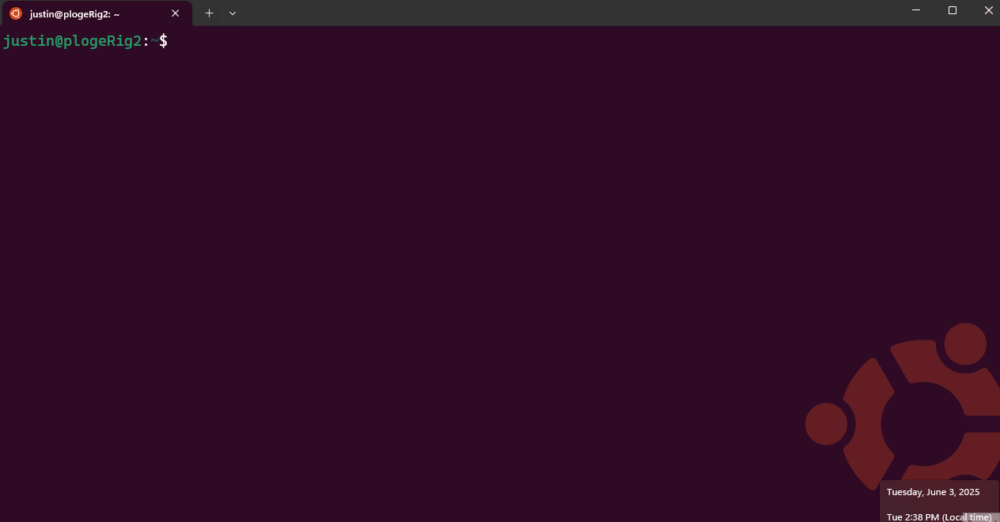

# Enable SSO in WSL (Windows Subsystem for Linux) apps using MSAL Python and WAM

MSAL is able to call the Microsoft Single Sign-on to Linux, a Linux component that is shipped independent of the Linux Distribution, however it gets installed using a package manager using `sudo apt install microsoft-identity-broker` or `sudo dnf install microsoft-identity-broker`.

This component acts as an authentication broker allowing the users of your app to benefit from integration with accounts known to Linux, such as the account you signed into your Linux sessions for apps that consume from the broker. It's also bundled as a dependency of applications developed by Microsoft, such as [Company Portal](/mem/intune-service/user-help/enroll-device-linux). These applications are installed when a Linux computer is enrolled in a company's device fleet via an endpoint management solution like [Microsoft Intune](/mem/intune/fundamentals/what-is-intune).

Using an authentication broker on Linux enables you to simplify how your users authenticate with Microsoft Entra ID from your application, and take advantage of future functionality that protects Microsoft Entra ID refresh tokens from exfiltration and misuse.

To enable SSO in your WSL app using MSAL Python, you must ensure the keychain is set up and unlocked, as MSAL uses `libsecret` to communicate with the keyring daemon.

## WSL Authentication Flow Example

In a situation where you have a WSL app that needs to authenticate with Microsoft Entra ID, the authentication flow for an interactive request would look like this:



## Update to the latest version of WSL

Ensure you have updated to the latest WSL release. The WAM Account Control dialog is supported in WSL versions 2.4.13 and above.

```powershell
# To check what distros are available:
wsl.exe --list --online

wsl.exe --install Ubuntu-22.04

# To check the WSL version:
wsl --version

# To update WSL:
wsl --update
```

## Linux Package Dependencies

Install the following dependencies on your Linux platform:

- `libsecret-tools` is required to interface with the Linux keychain

### [Ubuntu](#tab/ubuntudep)

To install on debian/Ubuntu based Linux distribution:

```bash
sudo apt install libsecret-1-0 -y

#from Powershell, run
wsl.exe --shutdown
```

### [Red Hat Enterprise Linux](#tab/rheldep)

To install on Red Hat/Fedora based Linux distribution:

```bash
sudo dnf install libsecret-1-0 -y

#from Powershell, run
wsl.exe --shutdown
```

---

> [!IMPORTANT]
> In order for the keychain to work as intended, you should make sure you 1. install the dependencies, 2. Reboot/restart wsl, 3. Configure the keychain. Failure to do the steps in the correct order will result with the keychain missing the option for "Password Keychain".

## Set up Keyring in WSL

MSAL uses `libsecret` on Linux. It's required to communicate with the `keyring` daemon. Users can use [Seahorse](https://wiki.gnome.org/Apps/Seahorse/) (a GNOME application for managing encryption keys and passwords) to manage the `keyring` contents through a Graphical User Interface (GUI).

On Debian-based distributions, you can install the package by running `sudo apt install seahorse` and then following these instructions:

1. Run `seahorse` in the terminal as a regular user (not as sudo)

    

2. In the top left corner, select **+** and create **Password** keyring.

    

3. Create a keyring named 'login'

    

4. Set the password on the next dialog.
    

5. Run `wsl.exe --shutdown` from your Windows Terminal.

6. Start a new WSL session and run the sample. You should be asked for the keyring password.

## Run a Sample App

To use a broker on the Linux platform, make sure you set the `BrokerOptions` to `OperatingSystems.Linux` as shown in the below code snippet:

Reference the [Enable SSO in native Linux apps using MSAL Python](./linux-broker-py.md) for information of how to configure the project.

### **Python Dependencies**

To use the broker, you will need to install the broker-related packages in addition to the core MSAL from PyPI:

```python
pip install "msal[broker]>=1.33.0b1,<2"
```

### Run the Sample App

Once configured, you can call `acquire_token_interactive` to acquire a token. Save the following as `wsl_broker.py`:

```python
import sys  # For simplicity, we'll read config file from 1st CLI param sys.argv[1]
import json
import logging
import requests
import msal

# Optional logging
# logging.basicConfig(level=logging.DEBUG)

var_authority = "https://login.microsoftonline.com/common"
var_client_id = " your-client-id-here"  # Replace with your app's client ID
var_username = "your-username-here"  # Replace with your username, e.g., "
var_scope = ["User.ReadBasic.All"]

# Create a preferably long-lived app instance which maintains a token cache (Default cache is in memory only).
app = msal.PublicClientApplication(
    var_client_id, 
    authority=var_authority,
    enable_broker_on_windows=True,
    enable_broker_on_wsl=True
    )

# The pattern to acquire a token looks like this.
result = None

# Firstly, check the cache to see if this end user has signed in before
accounts = app.get_accounts(username=var_username)
if accounts:
    logging.info("Account(s) exists in cache, probably with token too. Let's try.")
    result = app.acquire_token_silent(var_scope, account=accounts[0])

if not result:
    logging.info("No suitable token exists in cache. Let's get a new one from AAD.")
    
    result = app.acquire_token_interactive(var_scope,parent_window_handle=app.CONSOLE_WINDOW_HANDLE)
    
if "access_token" in result:
    print("Access token is: %s" % result['access_token'])

else:
    print(result.get("error"))
    print(result.get("error_description"))
    print(result.get("correlation_id"))  # You may need this when reporting a bug
    if 65001 in result.get("error_codes", []):  # Not mean to be coded programatically, but...
        # AAD requires user consent for U/P flow
        print("Visit this to consent:", app.get_authorization_request_url(config["scope"]))
```

### Run the Sample

Run the sample app using the following command:

```bash
python wsl_broker.py
```

You should see a prompt to:

- enter your username/credentials
- enter your keyring password
- then the app will acquire a token and print it to the console
